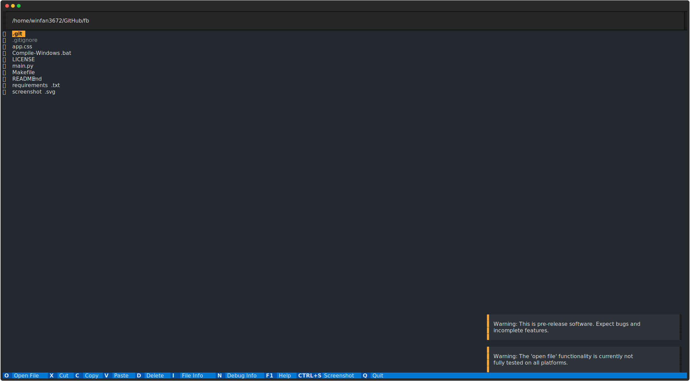

# fb

TUI File browser written using `textual`.
## What is it?
`fb` is a TUI (terminal user interface) program for browsing files. It has two simultaneous panels, an easy-to-use UI, and more.
## Why did you make it?
I couldn't find a similar tool. Most terminal-based tools are far too simple or far too complex, and none of them looked nice or familiar enough to meet my needs. So I decided to make my own. Sorry, `lf` users.
## Why 'fb'?
I noticed that a lot of similar tools ([lf](https://github.com/gokcehan/lf),[nnn](https://github.com/jarun/nnn), etc.) have 2-letter names for simplicity, so I went with `fb` because it stands for 'file browser'. 
## When will it be done?
I have no idea when; I hope to complete it one day.
## Using
First, make sure Python and `pip` are installed.

Next, install all dependencies using `pip`:
```
$ pip install -r requirements.txt
```
(Some systems use `pip3` instead of `pip`, so make sure that you have the right one!)

Then, clone the repo and run:
```
$ python main.py
```
(Again, some systems have `python3`, so make sure to check.)

NOTE: You need to run `fb` inside of a terminal or it won't work.
## Contributing
There are several ways you can contribute:
* Report issues. I would love to know if you have any bug reports or suggestions.
* Contribute code. Pull requests are welcome. In fact, I encourage it. If you're new to contributing to projects, definitely give it a try.
* Write documentation. If you enjoy doing that, go for it.
* Spread the word. If you like it, tell all your nerdy friends about it. Maybe they'll like it as well.
